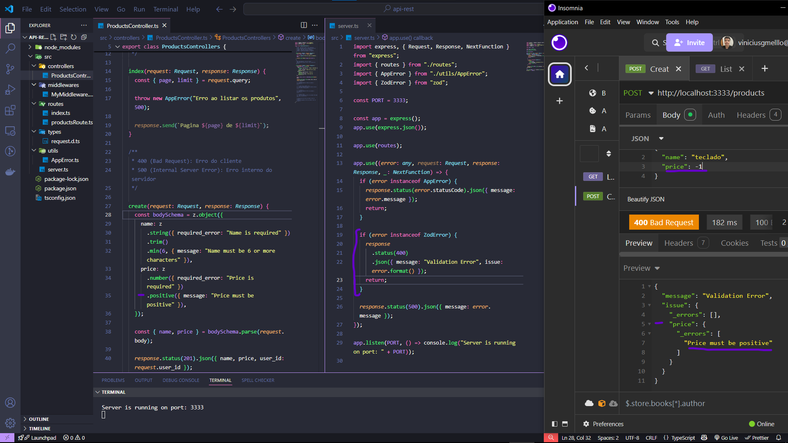

# 🚀 Projeto de API RESTful com Node.js, TypeScript e Zod

Uma API RESTful para gerenciamento de tickets de suporte técnico, desenvolvida como projeto de aprendizado das tecnologias back-end modernas.

## ✨ Tecnologias Utilizadas

- **Node.js** (v18+)
- **TypeScript** (Configuração ES2023)
- **Express** (Framework para rotas e middlewares)
- **Zod** (Validação de schemas)
- **TSX** (Execução em tempo de desenvolvimento)

## 🔧 Funcionalidades Principais

- Validação robusta com **Zod schemas**
- Sistema de middlewares customizados
- Tratamento profissional de erros
